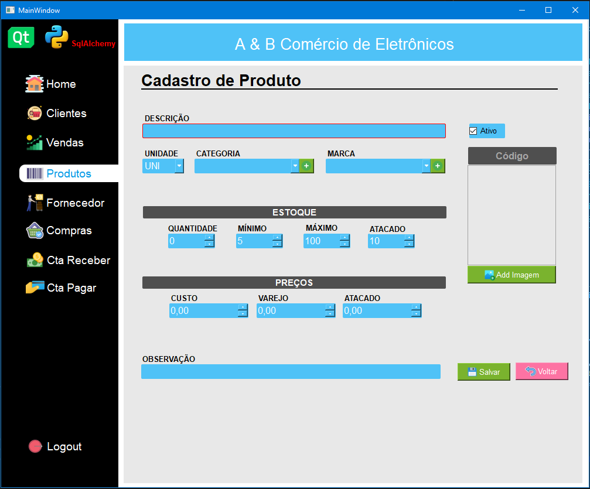
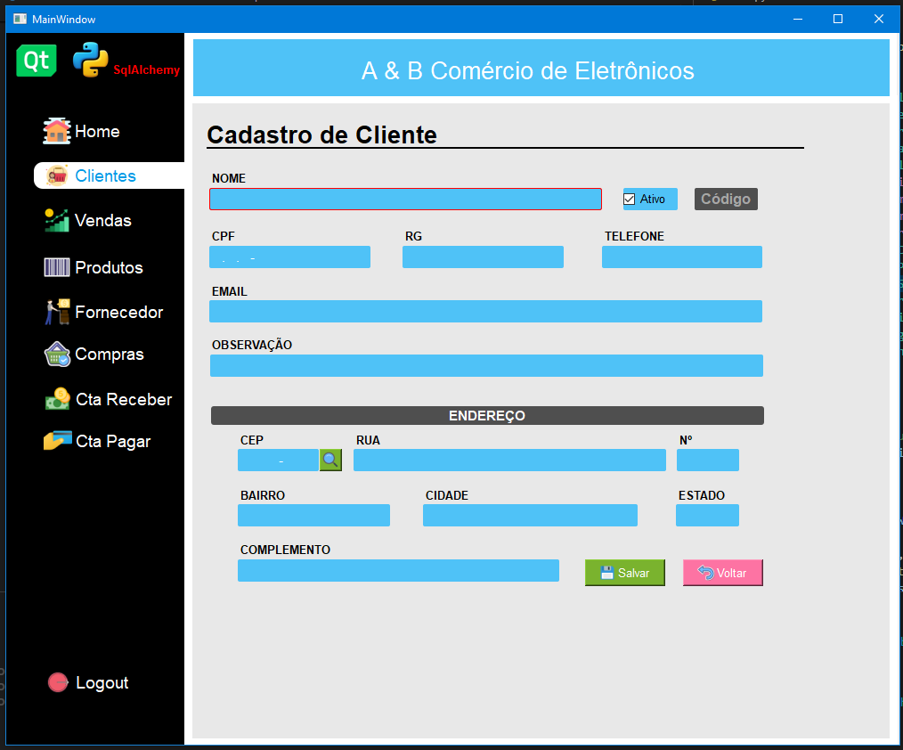
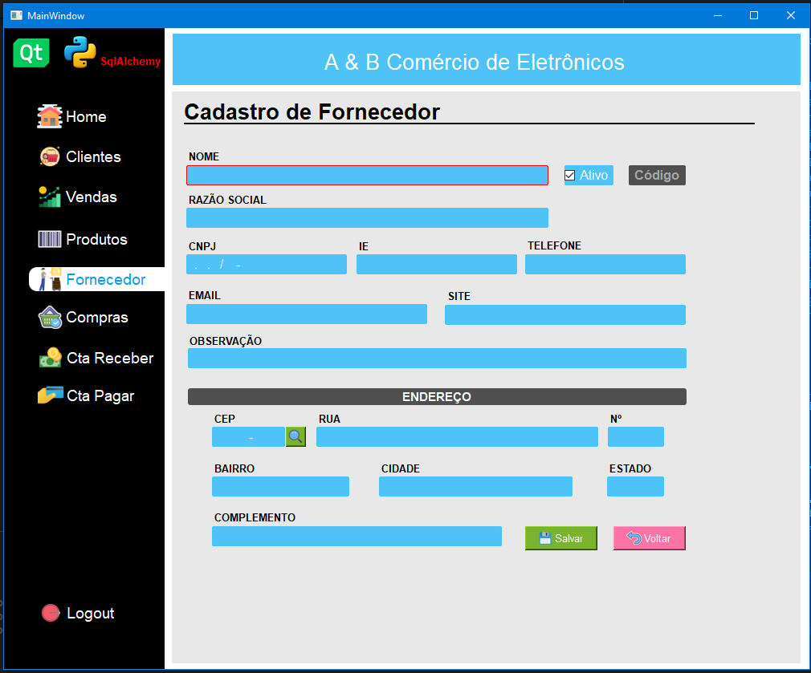
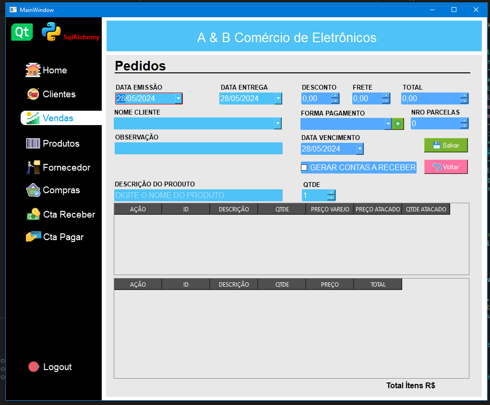
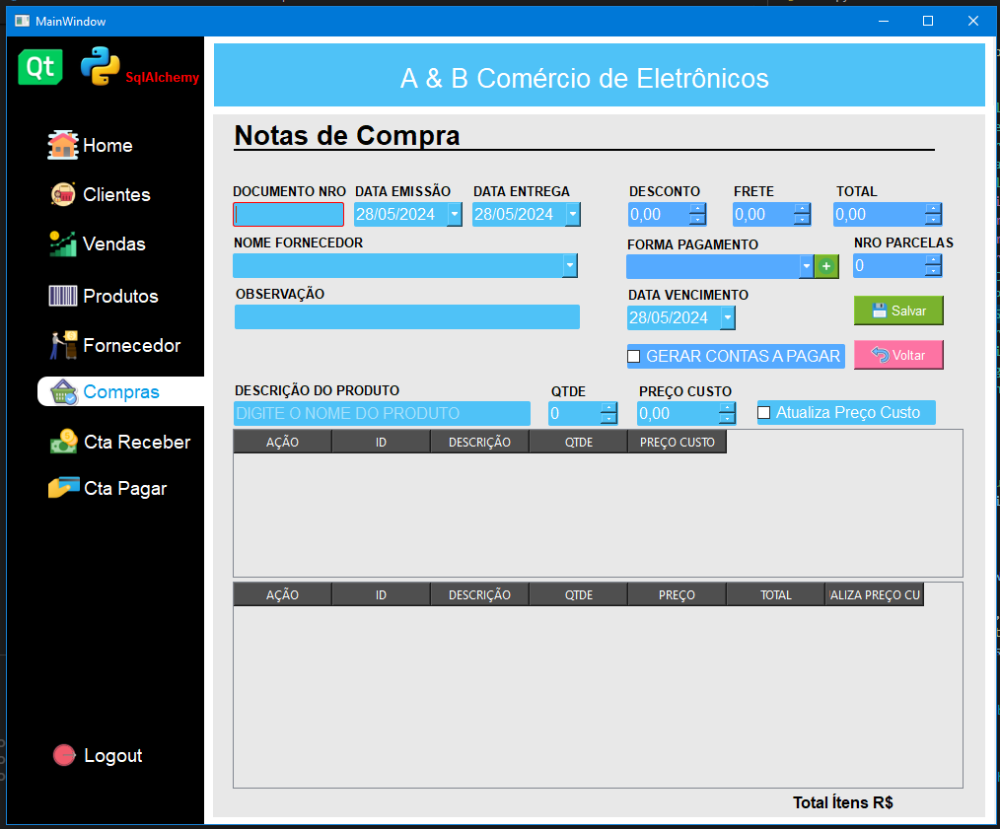

# Basico Controle de Estoque

[](https://www.python.org)
[](https://doc.qt.io/qtforpython-6/)
[](https://doc.qt.io/qtforpython-6/)
[](https://www.sqlite.org/index.html)
[](http://opensource.org/licenses/MIT)

## Instalação

```sh
pip install -r requeriments.txt
python main.py
```

# Telas
 
### Produto


### Cliente


### Fornecedor


### Venda


### Compra

